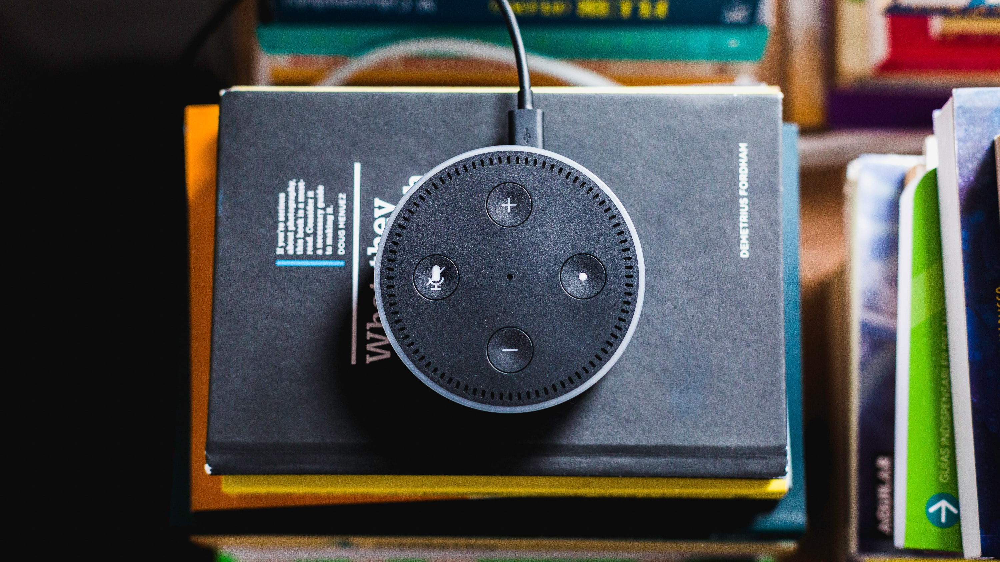

At work we use a lot of AWS. If you don't know what AWS is a quick google search should open your eyes to the deep, deep depths of AWS resources. Most of the web nowadays is built with AWS, it's wild to learn about (maybe I'll do that in the future or right now...). Just now I found some related articles that are super interesting:
- [W3Techs, oh boy!](https://w3techs.com/technologies/details/ho-amazon)
- [Gotta 💕 The Verge](https://www.theverge.com/2018/7/28/17622792/plugin-use-the-internet-without-the-amazon-cloud#:~:text=Share%20this%20story&text=Amazon%20servers%20make%20up%20so,visible%20connection%20to%20the%20company.)

Anywho, I thought it would be smart to try and get the [AWS Developer Certificate](https://aws.amazon.com/certification/certified-developer-associate/). I can add it to my resume, have a 💫 fancy 💫 new cert, and get some kudos at work. The studying process has been rewarding, yet challenging. Below are some useful resources I've used to prepare myself, Rocky 4 style!

## Resources:

### [Quizlet](https://quizlet.com/549134015/aws-certified-developer-associate-2020-flash-cards/):
- I made some of these, but not all. Quizlet is great because you can search, fork, and then customize/add notecards at will to your personal account. Plus you can then share with your friends. My gift to you friends :D

### [ACloudGuru's Dev Course](https://www.udemy.com/course/aws-certified-developer-associate/)
- I found this through Udemy after a work colleague recommended it. Very useful for learning/shoring up the high-level basics concerning exam specific resources. They cover the "popular" resources (ie the ones a lot of people use because they are super useful, reliable, and very stable) very well with visual examples and real time console work which I find super useful.

### [Whizlab Practice tests](https://www.whizlabs.com/aws-developer-associate/practice-tests/)
- A friend (shoutout Liz!) recommended these practice tests. They provide a glimpse into what the actual exam is like. I like these  a lot because they give you a feel for questions will be like for the actual exam. Given they provide exams that are only a few years old I trust that they are good guide for the look and feel come exam day.

That's all friends! Hope these resources serve you as well as they have served me.

Blessings 🙏 Good Luck
